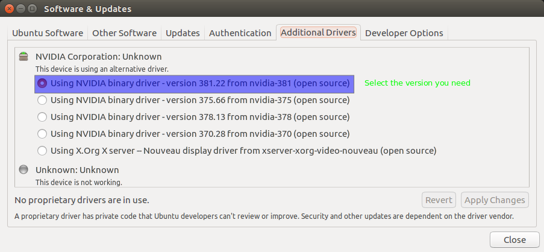
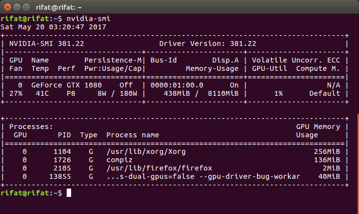

# Installing CUDA

- why CUDA?
- GPU VS CPU

Steps for making a Linux GPU machine ready for CUDA

01. Installing NVIDIA Drivers
02. Installing CUDA(nvcc)


## Installing NVIDIA Drivers:

```bash
sudo add-apt-repository ppa:graphics-drivers/ppa
sudo apt update
```

then,go to ubuntu "Software and Updates" > Additional Drivers and choose the version of driver that is needed,

Selecting the NVIDIA driver,
____________________________



## Installing CUDA(nvcc)

```bash
sudo apt install nvidia-cuda-toolkit
```

### To Monitor GPU

```bash
nvidia-smi
```
The command result is like,

NVIDIA smi command result,
_________________________


# References
[references](references.md)


